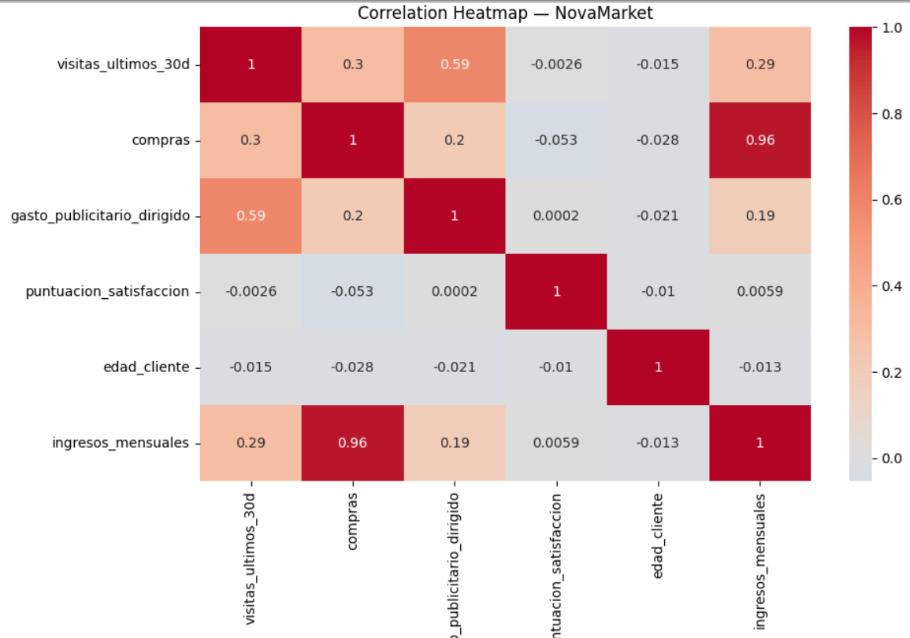
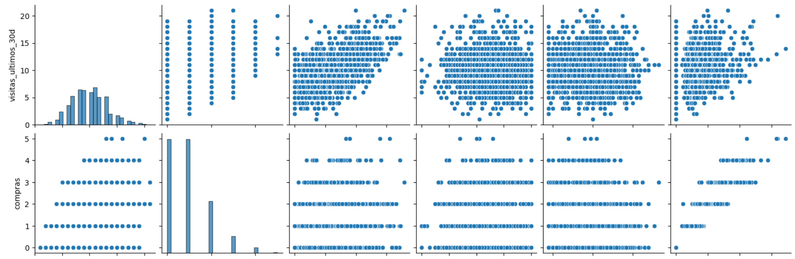
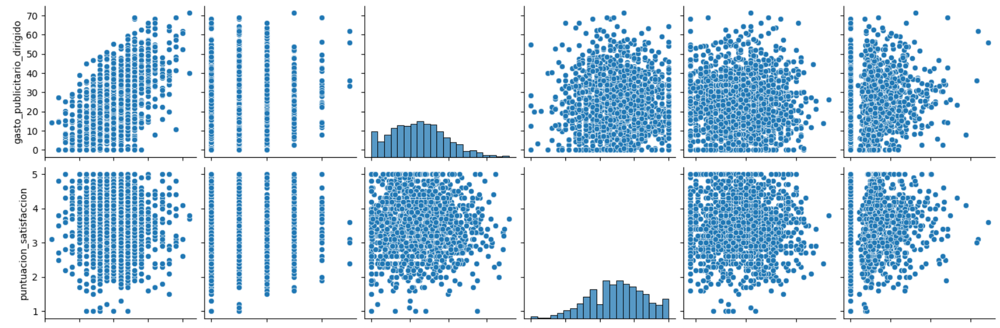
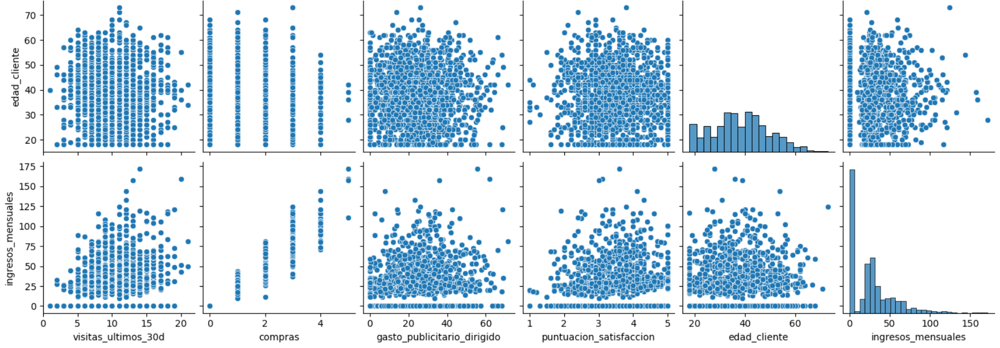

# Reporte_de_analisis_de_correlacion_NovaMarket
El objetivo de este reporte es identificar relaciones entre métricas clave
de actividad y compras que podrían estar asociadas con el ingreso  mensual
en NovaMarket.

El análisis es exploratorio y correlacional; no busca establecer causalidad,
sino generar hipótesis para análisis posteriores.

Observamos cómo se relacionan las variables numéricas usando
- Heatmap
- Scatterplot general
- Scatterplot para pares clave

  

  

  

  

  

Se reportan coeficientes que respaldan los patrones observados visualmente, utilizando el método adecuado según el tipo de variables.

### Pearson & Spearman (Visitas y Compras)
La correlación Pearson evalúa relación lineal.  
La correlación Spearman evalúa consistencia (monotonía).

La similitud entre ambos valores sugiere una relación
moderadamente lineal entre visitas y compras.

### Punto-biserial: estado suscripcion ingresos mensuales
Punto-biserial compara dos grupos (suscrito / no suscrito)
contra una variable numérica.

El coeficiente indica si existe diferencia entre ambos grupos,
no causalidad.

### V de Cramér: región y tipo de dispositivo
El coeficiente V de Cramér mide la fuerza de asociación entre categorías.  
Valores cercanos a 0 indican asociación débil.

### Hallazgo 1 — Visitas y compras

**Evidencia visual:** Scatterplot y heatmap  
**Evidencia numérica:** Pearson ≈ 0.29

**Interpretación**  
Los usuarios con mayor número de visitas tienden a realizar más compras,
aunque la relación es moderada.

**No podemos afirmar**  
Que aumentar visitas cause directamente más compras.

**Implicación de negocio**  
Explorar estrategias para aumentar engagement previo a la compra y
validarlas mediante experimentos controlados.

### Hallazgo 2 — Suscripción e ingresos

**Evidencia numérica:** Punto-biserial: 0.063 (positiva, prácticamente nula)

**Interpretación**  
Existe una asociación débil, prácticamente nula, entre el estado de suscripción y los ingresos mensuales.

**No podemos afirmar**  
Que la suscripción por sí sola explique el revenue.

**Implicación de negocio**  
La suscripción no debe usarse como criterio único de segmentación. Conviene analizarla junto con otras métricas.

